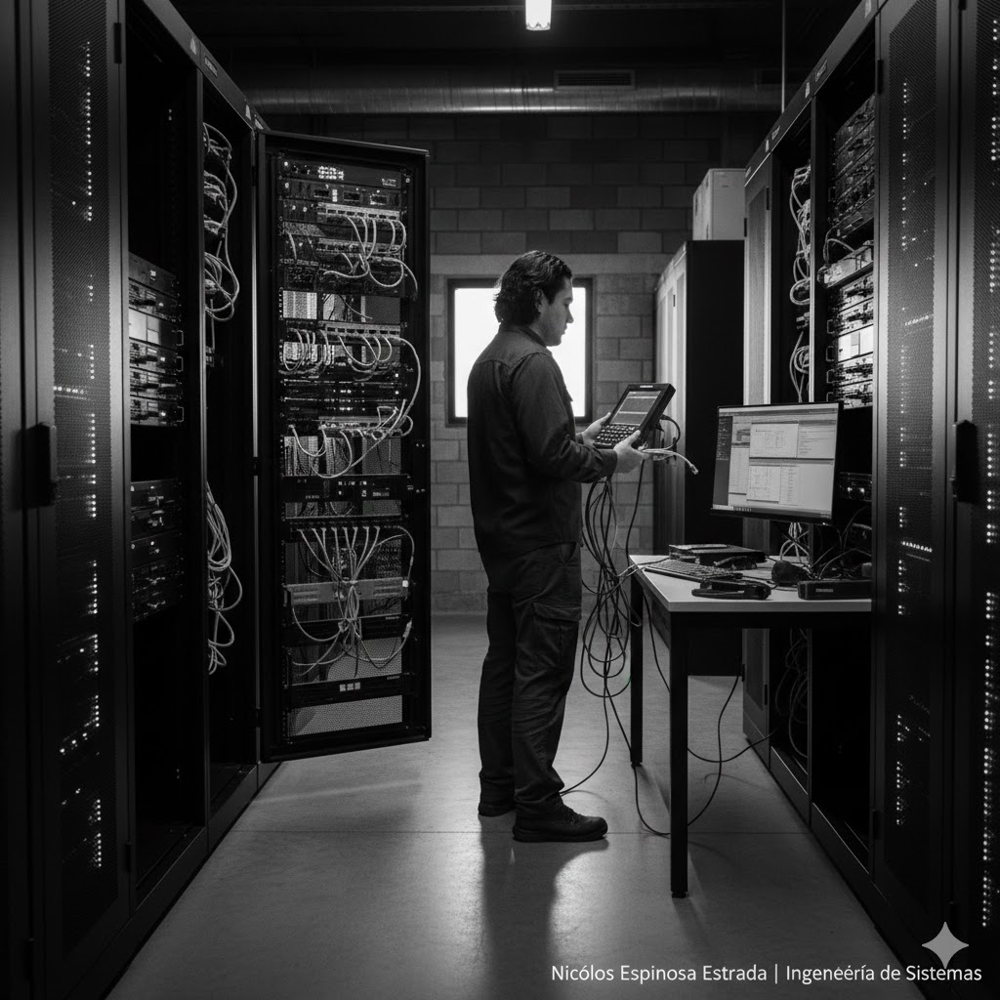

**Proyecto de Infraestructura y Soporte Técnico**

Este proyecto consistió en la intervención integral de la infraestructura tecnológica de la **Dirección de Educación Policial**, enfocándose en garantizar la alta disponibilidad de los servicios y la integridad física del hardware del centro de datos.

## Objetivos del Proyecto

1. **Asegurar la Continuidad:** Realizar mantenimiento preventivo profundo para evitar fallos de hardware en equipos de computo y servidores críticos.
2. **Optimización de Capa Física:** Corregir el cableado para mejorar el flujo de aire dentro de los racks y facilitar futuras intervenciones técnicas.
3. **Fortalecimiento de Seguridad:** Actualizar el software de seguridad para proteger la red contra vulnerabilidades recientes.

## Actividades Realizadas

1. **Mantenimiento Preventivo de Datacenter:**
- Limpieza técnica de componentes internos en servidores y estaciones de trabajo.
- Revisión de fuentes de poder y sistemas de ventilación.

2. **Gestión de Cableado y Conectividad:**
- Corrección y peinado de cableado estructurado.
- Implementación y configuración de soluciones **KVM** para la gestión centralizada de múltiples servidores desde una sola consola.

3. **Actualización y Seguridad:**
- Despliegue de parches de seguridad y actualización de firmware en equipos de red.
- Revisión exhaustiva del estado de los equipos de cómputo periféricos.

4. **Optimización de Video e Interfaz:**
- Estandarización de conexiones mediante cables DVI para asegurar la calidad de imagen en los centros de monitoreo.

## Stack Tecnológico y Herramientas

- **Hardware:** Sistemas de configuración de **Dell**, estaciones de trabajo de alto rendimiento.
- **Conectividad:** Gestión de interfaces **KVM**, cables DVI de alta fidelidad, cableado UTP Cat 6A.
- **Software:** Herramientas de diagnóstico de hardware Dell y software de gestión de seguridad institucional.

## Resultado

La intervención permitió reducir los tiempos de respuesta del equipo técnico gracias a la nueva organización del cableado y la implementación del KVM. Además, se logró una disminución del 15% en las alertas por temperatura en los racks, asegurando un entorno operativo estable para la educación policial.

## Testimonio de Gestión

> "La atención al detalle en la corrección del cableado y la actualización de los sistemas de seguridad fue fundamental para la estabilidad de nuestra red. Un trabajo técnico impecable en un entorno de misión crítica."

---