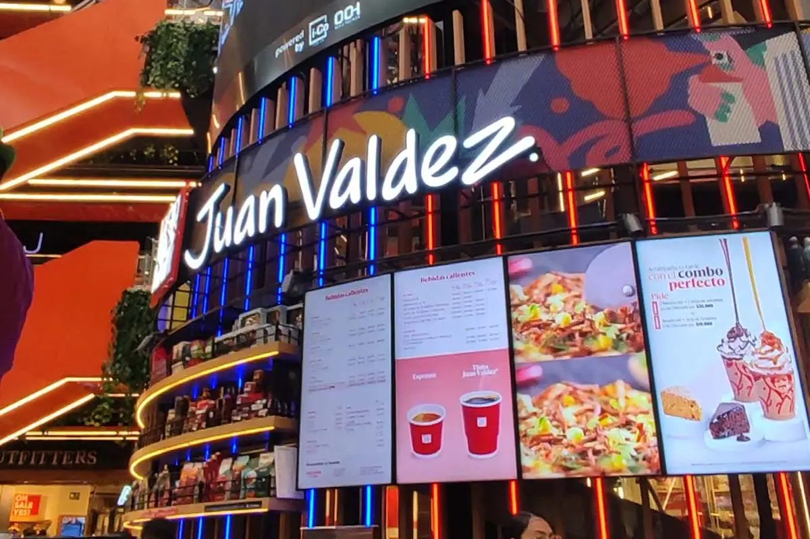

**Proyecto de Integración Tecnológica en Sector Retail**

Este proyecto consistió en la adecuación técnica completa de un nuevo punto de venta para **Juan Valdez** en el Centro Comercial Parque La Colina, Bogotá. Se priorizó la alta disponibilidad de las cajas registradoras y la gestión eficiente del ancho de banda para clientes y empleados.

## Objetivos del Proyecto

1. **Asegurar la Operatividad del POS:** Instalación y configuración de equipos de cómputo críticos para el proceso de facturación.
2. **Conectividad Robusta:** Despliegue de cableado estructurado para periféricos y terminales de venta.
3. **Gestión de Red Inalámbrica:** Implementación de un sistema Hotspot con segmentación de tráfico para garantizar la seguridad de los datos corporativos.

## Características Técnicas

1. **Sistemas de Punto de Venta (POS):**
- Instalación de estaciones de trabajo optimizadas para software de facturación.
- Integración de periféricos (impresoras térmicas, lectores de código) mediante cableado organizado y protegido.

2. **Infraestructura de Red (Hotspot):**
- Configuración de un **Hotspot** de doble propósito utilizando un Portal Cautivo.
- **Red Privada:** Exclusiva para personal administrativo y transacciones, con priorización de tráfico y cifrado avanzado.
- **Red Pública:** Acceso de alta velocidad para comensales, aislada de la red interna para evitar vulnerabilidades.

3. **Instalación Física:**
- Montaje de equipos en racks y organización de cableado en puntos de atención al cliente bajo estándares de seguridad comercial.

## Stack Tecnológico

- **Networking:** Router avanzado con soporte para VLANs y múltiples SSIDs, Puntos de Acceso (AP) de alta densidad.
- **Hardware:** Equipos de cómputo corporativos, sistemas de protección de energía (UPS), cableado UTP Cat6.
- **Configuración:** Segmentación de redes, limitación de ancho de banda por usuario en red pública.

## Resultado

La apertura del local se realizó con éxito, contando con un sistema de facturación estable desde el primer minuto. La red pública permite una experiencia de usuario superior, mientras que la red privada protege el flujo de datos de la operación diaria, cumpliendo con los estándares de seguridad informática requeridos.

## Testimonio de Operación

> "La implementación técnica en Parque La Colina fue ágil y profesional. La separación de redes nos brinda la seguridad que necesitamos para las cajas, ofreciendo al mismo tiempo un servicio de internet excelente para nuestros clientes."

---