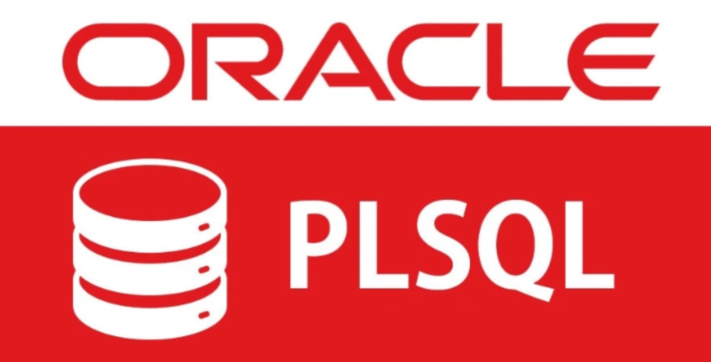

**Proyecto de Lógica Computacional en Base de Datos**

Este proyecto demuestra la capacidad de trasladar lógica de programación compleja (usualmente manejada en el backend) directamente al motor de la base de datos mediante PL/SQL, reduciendo la latencia en el transporte de datos.

## Objetivos del Proyecto

1. **Procesamiento Matemático Nativo:** Ejecutar cálculos complejos (Fibonacci, Mínimo Común Múltiplo, números primos) directamente en la base de datos.
2. **Control de Flujo:** Implementar estructuras condicionales y bucles eficientes para la evaluación sistémica de datos.
3. **Modelado y Auditoría:** Diseñar esquemas relacionales desde cero y auditar metadatos del diccionario de Oracle.

## Características Técnicas

1. **Algoritmos Iterativos y Condicionales:**
   - Implementación del algoritmo de Euclides para el cálculo del MCM mediante estructuras `WHILE`.
   - Generación de la sucesión de Fibonacci controlada por límites de memoria utilizando estructuras `LOOP`.

2. **Validaciones Matemáticas del Calendario:**
   - Creación de un script con bucles `FOR` anidados y condicionales `IF/ELSE` para determinar si el día actual (extraído con `SYSDATE`) corresponde a un número primo.

3. **Auditoría de Diccionario de Datos:**
   - Consulta a `all_tables` para mapear los objetos pertenecientes al usuario administrador (esquema `NESPINOSAE`).

## Stack Tecnológico

- **Motor de Base de Datos:** Oracle Database.
- **Lenguajes:** PL/SQL Avanzado, SQL (DDL).
- **Técnicas:** Bucles (`LOOP`, `FOR`, `WHILE`), redireccionamiento lógico (`GOTO`), consultas al Data Dictionary.

## Resultado

Se construyó una biblioteca de algoritmos eficientes que operan a nivel del servidor de base de datos. La ejecución local de esta lógica algorítmica reduce la dependencia de servidores de aplicaciones externos para cálculos matemáticos estructurados.

---