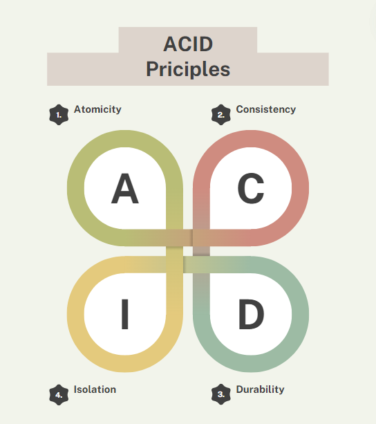

**Proyecto de Automatización y Rendimiento**

A diferencia de los scripts ejecutados manualmente, este proyecto se enfocó en la creación de "Objetos de Base de Datos" persistentes. El objetivo fue construir herramientas automatizadas que puedan ser invocadas por aplicaciones de terceros para la manipulación masiva de datos transaccionales.

## Objetivos del Proyecto

1. **Automatización de Procesos:** Crear procedimientos almacenados para ejecutar reglas de negocio críticas, como la actualización de nóminas.
2. **Procesamiento Iterativo:** Manejar grandes volúmenes de datos fila por fila de manera eficiente sin sobrecargar la memoria del servidor.
3. **Reutilización de Código:** Encapsular la lógica en objetos invocables con paso de parámetros dinámicos.

## Características Técnicas

1. **Procedimientos de Gestión Salarial:**
   - Desarrollo del procedimiento `upd_salary(p_id, p_percent)` para inyectar actualizaciones porcentuales al salario de los empleados.
   - Implementación de control transaccional explícito (`COMMIT`) para asegurar la atomicidad de la operación (ACID).

2. **Procesamiento de Conjuntos (Cursores):**
   - Declaración e iteración de **Cursores Explícitos Parametrizados**.
   - Creación de lógica para recorrer dinámicamente los empleados de un departamento específico pasado como argumento y extraer su información mediante bucles.

## Stack Tecnológico

- **Tecnología Principal:** Oracle PL/SQL.
- **Objetos de BD:** Procedimientos Almacenados (`CREATE OR REPLACE PROCEDURE`), Cursores Explícitos.
- **Conceptos:** Transaccionalidad (ACID), paso de parámetros (IN/OUT).

## Resultado

La implementación de estos procedimientos almacenados permitió encapsular la lógica de negocio directamente en el núcleo de la base de datos. Esto garantizó que cualquier actualización salarial masiva se realice de forma segura, estandarizada y con un rendimiento superior al de consultas enviadas desde aplicaciones externas.

---